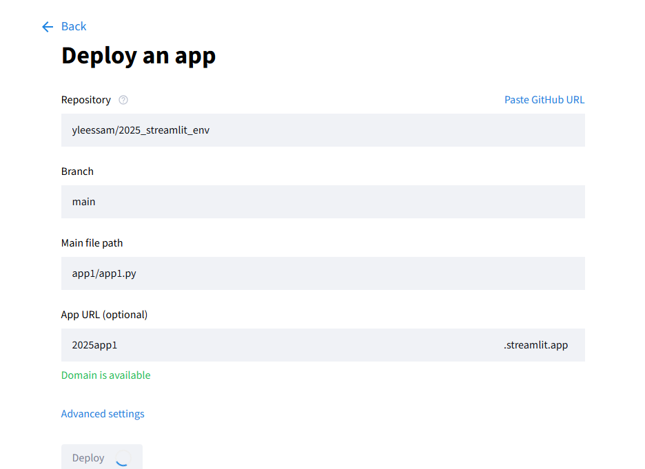

# Streamlit Community Cloud 배포

생성 일시: 2025년 8월 21일 오전 11:06

### **필수 준비물**

1. **GitHub 계정**: 코드를 저장하고 관리하기 위해 필요합니다.
2. **`requirements.txt` 파일**: 앱 실행에 필요한 라이브러리 목록을 적은 파일입니다. 이 파일이 없으면 서버가 어떤 라이브러리를 설치해야 할지 알 수 없습니다.

`app.py`와 같은 폴더에 `requirements.txt` 라는 이름의 파일을 만들고 아래 내용을 채워 넣으세요.

**`requirements.txt`**

`streamlit
pandas
numpy
matplotlib`

```bash
# 참고
python -m pip freeze > requirements.txt
```

### **배포 절차**

1. **GitHub에 코드 올리기**
    - GitHub에 새로운 리포지토리(저장소)를 만듭니다.
    - 만든 리포지토리에 `app.py`와 `requirements.txt` 두 파일을 모두 올립니다(push).
2. **Streamlit Community Cloud 가입 및 연결**
    - [share.streamlit.io](https://share.streamlit.io/) 로 이동하여 **GitHub 계정으로 가입하거나 로그인**합니다.
    - GitHub 계정 연결을 승인합니다.
3. **앱 배포하기**
    - 대시보드에서 'New app' 버튼을 클릭합니다.
    - 'Deploy from GitHub'를 선택하고, 코드를 올려둔 **리포지토리**와 **브랜치**(보통 main)를 선택합니다.
    - **Main file path**가 `app.py`로 잘 지정되었는지 확인합니다.
        
        
        
    - 'Deploy!' 버튼을 누릅니다.

잠시 기다리면 Streamlit이 자동으로 필요한 라이브러리를 설치하고 앱을 빌드하여, `your-app-name.streamlit.app` 형태의 **공개 주소**를 만들어 줍니다. 이제 이 주소를 누구에게나 공유할 수 있습니다.


---

### **민감정보 처리 방법: Streamlit의 Secrets 관리 기능 사용**

<aside>
💡

무료 플랜을 사용하려면 GitHub 리포지토리가 **퍼블릭(Public)**이어야 합니다

</aside>

**소스 코드 공개**: 리포지토리가 퍼블릭이므로 누구나 나의 앱 코드를 볼 수 있습니다.

**민감 정보 관리**:  코드에 **API 키, 비밀번호, 데이터베이스 접속 정보, 개인 정보** 등 민감한 데이터들이 GitHub에 올라가면 누구나 볼 수 있게 되어 보안 사고로 이어질 수 있습니다.

이러한 민감 정보는 Streamlit Community Cloud가 제공하는 **Secrets 관리 기능**을 사용해 안전하게 처리해야 합니다.

1. **Streamlit Cloud에 Secrets 등록**: 배포된 앱의 설정 메뉴(`Settings`)에 들어가 `Secrets` 항목에 키(key)와 값(value)을 등록합니다.
2. **코드에서 안전하게 호출**: 코드에서는 `st.secrets` 딕셔너리를 통해 등록된 값을 불러옵니다.
    
    
    **나쁜 예 (절대 이렇게 하지 마세요):**
    
    ```bash
    # 코드에 API 키를 직접 작성한 경우
    api_key = "sk-123456789abcdefg"
    ```
    
    좋은 예 (st.secrets 사용):
    
    ```bash
    import streamlit as st
    
    # Streamlit Cloud에 등록된 값을 안전하게 불러오기
    api_key = st.secrets["MY_API_KEY"]
    db_password = st.secrets["DB_PASSWORD"]
    ```